# Contenu réel de la landing

> Fichier **généré** par `pipeline/exporter-contenu.mjs`. Ne pas le modifier :
> la source est `pipeline/contenu-initial.mjs`, ou la console `/admin`.

## Les 6 leviers de gestion

| Lettre | Clé | Nom | La question |
| --- | --- | --- | --- |
| T | `trafic` | Trafic | Combien de clients entrent ? |
| R | `recurrence` | Récurrence | Combien reviennent ? |
| E | `xp` | Expérience | Que vivent-ils sur place ? |
| F | `food` | Food Cost | Que coûte ce qu’on sert ? |
| L | `labour` | Labour | Que coûtent les heures ? |
| O | `overhead` | Overhead | Que coûte la structure ? |

---

## Page d'accueil

**Titre** — La valeur d'un réseau, c'est sa capacité à être transmis

**Sous-titre** — Un ERP qui met le savoir-faire dans l'outil plutôt que dans la tête de quelques personnes.

**Accroche**

Un réseau se vend sur ce qu'il peut transmettre. Tant que les procédures vivent dans la mémoire des fondateurs, dans des tableurs personnels et dans des habitudes prises en magasin, ce qui se transmet n'est qu'une enseigne et un bail. Le repreneur rachète un nom, pas une méthode.

Nos neuf modules couvrent l'exploitation réelle d'un réseau : le recrutement des franchisés, la vente en ligne, le pilotage du siège et du point de vente, l'approvisionnement, la production, l'animation terrain, la livraison et l'affichage. Chacun a la même exigence : ce qui est fait laisse une trace datée et attribuée, et ce qui est décidé est écrit quelque part d'autre que dans une conversation.

**Bouton** — « Demander une démonstration » vers `#contact`

### Les problèmes du franchiseur

- **L'exécution en magasin est invisible** — Le siège apprend qu'un standard n'est pas tenu quand un client se plaint, ou lors d'une visite. Entre les deux, personne ne sait. L'écart entre deux points de vente se creuse sans que rien ne le signale.
- **L'information remonte tard et déformée** — Les chiffres arrivent par tableur en fin de mois, recopiés au moins deux fois. Quand ils arrivent, le trimestre est joué et la discussion porte sur la fiabilité du fichier plutôt que sur la décision à prendre.
- **Les procédures ne survivent pas au départ** — Le savoir-faire tient dans quelques personnes. Un responsable qui part emporte le tour de main, la mémoire des clients difficiles et les raisons derrière chaque règle. Le successeur réapprend au prix d'une saison.
- **Chaque outil raconte une histoire différente** — Le site annonce un stock, la cuisine en connaît un autre, le chauffeur découvre le troisième. La ressaisie entre ces mondes coûte des heures et introduit les erreurs qu'on passe ensuite à corriger.
- **« Vérifié » ne prouve rien** — Une case cochée sans nom ni horodatage ne démontre rien — ni à un franchisé, ni à un contrôle, ni à un repreneur. Le réseau ne peut pas prouver que ses standards existent ailleurs que dans son discours.

### Nos réponses

- **Le terrain saisit là où il travaille** — Les applications de la cuisine, de l'animateur et du chauffeur sont installables depuis un navigateur et fonctionnent hors ligne. La donnée naît au poste de travail, une seule fois, au moment où le geste est fait.
- **Chaque contrôle porte un nom et une heure** — Checklists de poste, checklists de visite notées, preuve de livraison géolocalisée : ce qui est vérifié est attribué et daté. Un standard devient démontrable, donc transmissible.
- **Un seul référentiel produit** — Le catalogue du siège alimente le webshop, les consoles franchisées et les écrans en magasin. Un prix se change une fois. Le stock du jour vu en cuisine est celui que le site consulte avant d'accepter une commande.
- **La frontière siège–franchisé est un réglage** — La fiche de chaque boutique dit ce qui est hérité du siège et ce que le franchisé pilote chez lui. La règle ne se renégocie pas à chaque changement de propriétaire.
- **Les incidents se comptent** — Motifs codifiés, partagés entre l'application du chauffeur et la console du magasin. Un défaut récurrent devient un chiffre comparable entre boutiques, donc un sujet qu'on traite.

### Schéma d'ensemble

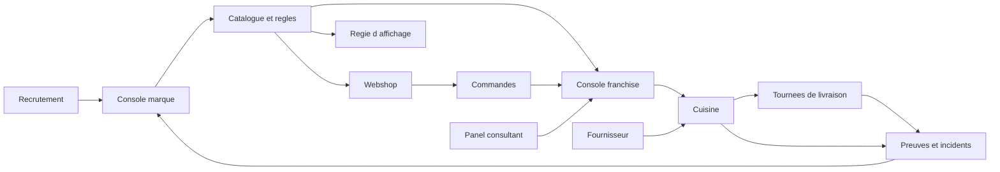

---

## Webshop

`webshop` · famille **Vente** · ordre 1 · 7 fonctions

**Leviers** — T Trafic · R Récurrence · E Expérience

**Public visé** — Clients du réseau, particuliers et entreprises

**Accroche** (60 car.) — La boutique en ligne du réseau, déclinée par point de vente.

**Résumé** (268 car.)

Le client commande sur le site de son magasin, pas sur un site générique : catalogue, prix, jours d'ouverture et créneaux sont ceux de ce point de vente. La disponibilité est vérifiée avant le paiement, et la commande atterrit directement dans la console du franchisé.

**Phrase d'onboarding** — Première semaine : vous choisissez une boutique pilote, vous vérifiez que son catalogue, ses créneaux et son heure limite sont justes, et vous ouvrez la vente. Ce que vous gagnez tout de suite : plus aucune commande acceptée que la cuisine ne peut produire.

### Ce que ce module fait disparaître

- **Commandes impossibles à produire** — Un site qui ignore le stock et la capacité du magasin accepte des commandes que la cuisine ne peut pas honorer. Le franchisé passe sa matinée à rappeler des clients pour annuler.
- **Un site par boutique, ou aucun** — Soit chaque franchisé bricole sa propre vitrine et le réseau perd toute cohérence, soit un site unique impose le même catalogue partout. Les deux abîment la marque.
- **Le prix affiché n'est pas le prix facturé** — Quand les remises se calculent dans le navigateur, chaque écart devient un litige. La confiance du client se joue sur ce détail.

### Ce qu'il apporte

- **Une vitrine par point de vente** — Le catalogue réseau est filtré et tarifé pour la boutique choisie. Le franchiseur garde le référentiel, le franchisé garde son assortiment réel.
- **Aucune commande invendable** — Stock du jour, capacité du créneau et heure limite sont vérifiés avant le paiement. Ce qui est vendu est produisible.
- **Un seul moteur de prix** — Règles du siège, promotions locales et bons se résolvent côté serveur. Le prix affiché est celui qui sera facturé.
- **Une enseigne de plus sans redéveloppement** — Couleurs, logo et typographies viennent de la configuration de la boutique. Ouvrir une nouvelle marque dans le réseau relève du paramétrage.

### Le menu, entrée par entrée (7)

| Entrée | Leviers | À quoi elle sert | Le gain |
| --- | --- | --- | --- |
| **Catalogue par boutique** `catalogue` | T | Le même catalogue réseau, filtré et tarifé pour la boutique choisie : assortiment, prix local, saison, allergènes. Changer de boutique change la vitrine, pas le référentiel. | Le siège garde la main sur l'offre sans imposer le même rayon à tous. |
| **Créneaux et heure limite** `creneaux` | E L | Le moteur de disponibilité croise les jours d'ouverture, le stock du jour et le remplissage du créneau. L'heure limite est lue dans la configuration de la boutique et réévaluée en continu. | Plus d'annulation le lendemain matin faute de capacité. |
| **Tarifs, bons et remises** `tarifs` | F R | Le devis du panier est calculé côté serveur : règles de prix du siège, promotions locales, bons validés à l'usage, offre croisée par portion. Le client voit un prix, pas une estimation. | Le montant annoncé est le montant facturé, sans litige. |
| **Commande B2B** `b2b` | R T | Les entreprises commandent pour un bureau et un service, sur une tournée existante, avec leurs frais de livraison propres et leur numéro de TVA vérifié. | La facture part au bon service sans ressaisie comptable. |
| **Compte et suivi de commande** `compte` | R | Inscription, session, historique et suivi : le client retrouve ses commandes passées et l'état de celle du jour, la même donnée que celle affichée en magasin. | Le magasin et le client regardent le même écran quand ils s'appellent. |
| **Thème par enseigne** `marque` | T | Couleurs, logo et typographies viennent des jetons de la boutique servis par l'API. Une enseigne de plus dans le réseau ne demande pas un nouveau front. | Une seconde marque se lance en paramétrage, pas en projet. |
| **Quatre langues** `langues` | T | Français, néerlandais, anglais et allemand, choisis par le client — indispensable pour un réseau belge où deux boutiques voisines ne parlent pas la même langue. | Le réseau s'étend sur une frontière linguistique sans dupliquer le site. |

### Ce qu'il échange avec les autres modules

- reçoit de **console-marque** : le catalogue, les prix et les promotions du siège
- envoie vers **console-franchise** : les commandes du jour, prêtes à préparer
- reçoit de **console-franchise** : le stock du jour et les créneaux disponibles

### Description longue

Un réseau qui vend en ligne se heurte vite au même mur : un site unique ne sait pas qu'une boutique ferme le lundi, qu'une autre n'a plus de pâte à tarte, et qu'une troisième pratique un tarif différent. Résultat, des commandes acceptées que personne ne peut produire, et un franchisé qui appelle le client pour annuler.

Le webshop part de la boutique. Le visiteur choisit son point de vente, et tout découle de ce choix : l'assortiment, les prix, les jours ouvrés, les créneaux de retrait ou de livraison. Le moteur de disponibilité croise le stock du jour, le remplissage du créneau et l'heure limite de commande avant d'accepter le paiement.

Le devis du panier est calculé côté serveur. Les règles de prix du siège, les promotions locales du franchisé et les bons de réduction sont résolus au même endroit, dans cet ordre : le client voit un prix ferme, pas une estimation qui bougera à la facturation.

Les entreprises ont leur propre parcours — commande pour un bureau et un service, sur une tournée existante, avec le numéro de TVA vérifié et les frais de livraison négociés. Le thème visuel vient des jetons de la boutique servis par l'API, ce qui permet d'ajouter une enseigne au réseau sans redévelopper de front.

### Schéma

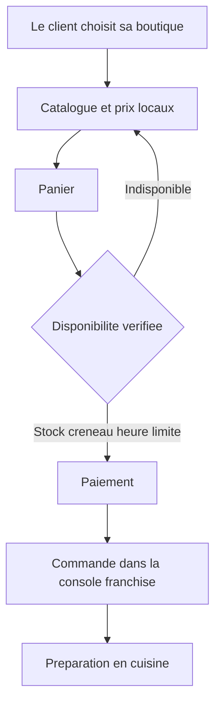

---

## Console marque

`console-marque` · famille **Pilotage** · ordre 2 · 8 fonctions

**Leviers** — T Trafic · R Récurrence · F Food Cost · O Overhead

**Public visé** — Direction du réseau, animation, marketing

**Accroche** (67 car.) — L'écran du franchiseur : ce que le réseau vend, et ce qu'il a fait.

**Résumé** (255 car.)

Le back office du siège. Il décide ce que le réseau vend — catalogue, formules, prix, promotions — et voit ce que le réseau a fait : chiffre consolidé, boutique par boutique, zone par zone. Les droits sont posés par rôle, avec un journal d'audit derrière.

**Phrase d'onboarding** — C'est par ici qu'on commence. Vous y déclarez vos boutiques, vous montez le catalogue une fois, et vous décidez ce que chaque franchisé peut modifier chez lui. Tout le reste du réseau lit ces décisions.

### Ce que ce module fait disparaître

- **Le siège découvre trop tard** — Quand les chiffres remontent par tableur en fin de mois, l'écart entre deux boutiques se constate au lieu de se corriger. Un trimestre se perd vite.
- **Chacun sa règle du jeu** — Sans frontière explicite entre ce que décide le siège et ce que décide le franchisé, chaque négociation se rejoue à chaque changement de propriétaire.
- **Les ouvertures se décident à l'instinct** — Sans lecture géographique des ventes, on ouvre là où une opportunité se présente, quitte à cannibaliser une boutique existante.

### Ce qu'il apporte

- **Le réseau visible sur un écran** — Indicateurs consolidés et détail par boutique au même endroit. L'écart se voit le jour où il apparaît, pas à la clôture.
- **Une source unique pour le catalogue** — Webshop, écrans en magasin et back-offices franchisés lisent tous le même référentiel. Un changement de prix se fait une fois.
- **La gouvernance devient un réglage** — Ce que le franchisé peut modifier est coché dans sa fiche. La règle survit au départ de celui qui l'avait négociée.
- **Des ouvertures documentées** — Zones de chalandise, recouvrements et secteurs vides sur la carte. La décision d'ouverture s'appuie sur les ventes réelles.

### Le menu, entrée par entrée (8)

| Entrée | Leviers | À quoi elle sert | Le gain |
| --- | --- | --- | --- |
| **Tableau de bord réseau** `dashboard` | T F | Les indicateurs du réseau consolidés au siège, avec le détail par boutique en dessous : on voit l'écart entre les points de vente sans exporter quoi que ce soit. | L'écart se traite dans la semaine, pas au trimestre. |
| **Boutiques du réseau** `boutiques` | O | La fiche de chaque point de vente — ouverture, périmètre, réglages hérités du siège — et ce que le franchisé a le droit de modifier chez lui. | La gouvernance est un interrupteur, pas une convention orale. |
| **Catalogue produits** `catalogue` | F | L'arbre catégories puis produits, avec la saison et la disponibilité. C'est la source unique que lisent le webshop, les écrans en magasin et les consoles franchisées. | Un prix se change une fois et se propage partout. |
| **Menus et formules** `menus` | F | Le constructeur de formules : une formule, ses étapes, les choix ouverts à chaque étape, et le prix résolu côté serveur avec sa marge. | La marge d'une formule est connue avant de la lancer. |
| **Promotions réseau** `promotions` | T R | Bons de réduction et règles de prix décidés au siège, avec le périmètre des boutiques concernées. Le franchisé garde ses promotions locales à côté, sans écraser celles de la marque. | Une opération nationale se lance sans appeler chaque magasin. |
| **Analyse géographique** `geo` | T | Les ventes rapportées aux codes postaux : zones de chalandise, recouvrements entre boutiques, secteurs vides. C'est l'écran qui sert à décider où ouvrir. | Une ouverture cesse d'être un pari. |
| **Traçabilité clients** `tracabilite` | R | Le parcours d'un client à travers le réseau : où il commande, à quelle fréquence, sous quelle enseigne. Utile quand plusieurs boutiques servent la même personne. | Le client appartient au réseau, pas à une boutique. |
| **Prospects** `prospects` | O | Les candidats franchisés et les demandes d'ouverture suivis au même endroit que le reste du réseau, plutôt que dans un tableur à part. | Le développement du réseau se pilote comme le reste. |

### Ce qu'il échange avec les autres modules

- envoie vers **webshop** : le catalogue, les formules et les règles de prix
- envoie vers **console-franchise** : ce que le franchisé peut modifier chez lui
- envoie vers **affichage** : les produits et tarifs affichés en magasin
- reçoit de **consultant** : les comptes rendus de visite et les écarts constatés

### Description longue

La question qui revient chez tout franchiseur : qu'est-ce qui se passe réellement dans mes points de vente ? Tant que la réponse suppose d'appeler douze franchisés et de recoller douze tableurs, le réseau n'est pas pilotable — et il n'est pas transmissible non plus, puisque tout le savoir tient dans la tête de celui qui passe les appels.

La console marque met les deux moitiés du métier sur le même écran. D'un côté ce que le siège décide : l'arbre du catalogue, les formules et leurs étapes, les règles de prix, les promotions réseau et leur périmètre. De l'autre ce que le réseau produit : indicateurs consolidés, détail par boutique, ventes rapportées aux codes postaux.

L'analyse géographique mérite qu'on s'y arrête. Les ventes projetées sur les zones de chalandise montrent les recouvrements entre boutiques et les secteurs vides. C'est l'écran qui sert à décider où ouvrir la suivante, plutôt qu'à justifier après coup une ouverture décidée à l'instinct.

La gouvernance est explicite : la fiche boutique dit ce que le franchisé a le droit de modifier chez lui et ce qui reste hérité du siège. C'est un interrupteur, pas une convention orale — et c'est précisément ce qui rend une procédure transmissible à un nouveau propriétaire.

### Schéma

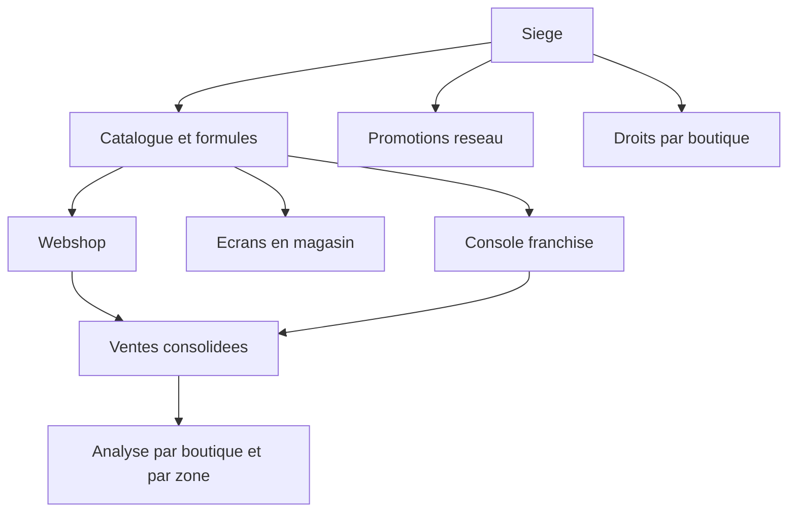

---

## Console franchisé

`console-franchise` · famille **Pilotage** · ordre 3 · 8 fonctions

**Leviers** — E Expérience · F Food Cost · L Labour · O Overhead

**Public visé** — Franchisés et responsables de point de vente

**Accroche** (70 car.) — La journée du point de vente : préparation, livraison, stock, clients.

**Résumé** (243 car.)

Le pendant magasin de la console marque. Le franchisé y voit sa journée — ce qu'il faut préparer, ce qui part en tournée, ce qui manque — et gère ce qui lui appartient : clients professionnels, créneaux, frais de livraison, promotions locales.

**Phrase d'onboarding** — À ouvrir le matin. La journée du magasin y tient sur un écran : ce qu'il faut préparer, ce qui part en tournée, ce qui manque. Le franchisé y gère ce qui lui appartient sans passer par le siège.

### Ce que ce module fait disparaître

- **Deux vérités sur le stock** — Quand le site et le magasin ne lisent pas la même disponibilité, la rupture se découvre au moment de produire. Le client l'apprend par téléphone.
- **Le franchisé bloqué sur son propre métier** — S'il faut passer par le siège pour ajouter un client B2B ou fermer un créneau, le magasin perd des heures sur des décisions qui lui appartiennent.
- **Des incidents incomparables** — Rédigés en texte libre, les problèmes ne se comptent pas. Un défaut récurrent dans le réseau reste invisible jusqu'à ce qu'il coûte cher.

### Ce qu'il apporte

- **La journée sur un écran** — Commandes à préparer, tournées engagées, incidents ouverts, avec les compteurs qui disent où ça coince.
- **Un seul stock** — La disponibilité vue au magasin est celle que consulte le webshop. Fermer un produit le retire de la vente immédiatement.
- **Le local reste local** — Clients B2B, créneaux, frais de livraison et promotions du magasin se gèrent sans passer par le siège.
- **Des incidents qui se comptent** — Les mêmes motifs codifiés que l'app chauffeur, donc des chiffres comparables entre boutiques.

### Le menu, entrée par entrée (8)

| Entrée | Leviers | À quoi elle sert | Le gain |
| --- | --- | --- | --- |
| **Tableau de bord du jour** `dashboard` | L E | Commandes à préparer, tournées engagées, incidents ouverts : la journée du magasin sur un écran, avec les compteurs qui disent où ça coince. | Le responsable sait où porter son attention en arrivant. |
| **Préparation des commandes** `preparation` | L | Les commandes du jour regroupées par tournée ou à plat, avec le détail article par article. C'est la liste que suit l'équipe en cuisine et que le chauffeur contre-scanne au chargement. | Une seule liste sert la production et le contrôle au départ. |
| **Livraison du jour** `livraison` | E L | L'état des tournées en cours vu du magasin : ce qui est parti, ce qui est livré, ce qui traîne. | Le magasin répond au client sans appeler le chauffeur. |
| **Stock du jour** `stock` | F | La disponibilité par produit et par jour, celle-là même que le webshop consulte avant d'accepter une commande. | Fermer un produit ici le retire de la vente en ligne tout de suite. |
| **Clients et demandes B2B** `b2b` | R | Les entreprises livrées : sociétés, services, sites de livraison, e-mails de facturation. Les demandes entrantes se traitent ici et alimentent les tournées. | Le franchisé développe son B2B sans dépendre du siège. |
| **Incidents et litiges** `incidents` | E | Les incidents remontés du terrain — colis manquant, client absent, litige de facturation — avec leur preuve et leur suite, sur les mêmes motifs codifiés que l'app chauffeur. | Les problèmes se comptent au lieu de se raconter. |
| **Capacité et remplissage** `capacite` | L E | Les créneaux, leur remplissage et les fermetures exceptionnelles. | Ce qui est vendu en ligne reste produisible en cuisine. |
| **Rentabilité** `rentabilite` | O F | Ce que rapporte réellement une tournée ou un client une fois les frais de livraison posés en face. | La discussion sur les frais se fait sur des chiffres. |

### Ce qu'il échange avec les autres modules

- envoie vers **webshop** : la disponibilité qui autorise ou bloque une vente
- envoie vers **cuisine** : les commandes à produire dans la journée
- envoie vers **livraison** : les tournées et le bon de chargement à contre-scanner
- reçoit de **livraison** : les preuves de livraison et les incidents

### Description longue

Un franchisé passe sa journée entre la production, les livraisons et le téléphone. Ce qu'il lui faut n'est pas un outil de reporting, c'est un écran qui lui dit ce qui se passe maintenant : combien de commandes à préparer, quelles tournées sont parties, quel produit manque, quel incident est ouvert.

La console franchisé sépare nettement deux choses. Ce qui vient du siège — le catalogue, les règles de prix, les formules — arrive d'en haut et ne se discute pas depuis le magasin. Ce qui est local — les clients B2B, les créneaux, les frais de livraison, les promotions du magasin — appartient au franchisé et se règle chez lui.

Le stock du jour mérite une mention particulière : c'est la même table que consulte le webshop avant d'accepter une commande. Fermer un produit ici le retire de la vente en ligne immédiatement. Il n'y a pas deux vérités, une pour le magasin et une pour le site.

Les incidents utilisent les mêmes motifs codifiés que l'application du chauffeur. Un colis manquant déclaré sur la route et un litige constaté au magasin portent la même étiquette, donc les chiffres se comparent d'une boutique à l'autre — condition pour que le siège puisse traiter un problème récurrent au lieu de le découvrir par hasard.

### Schéma

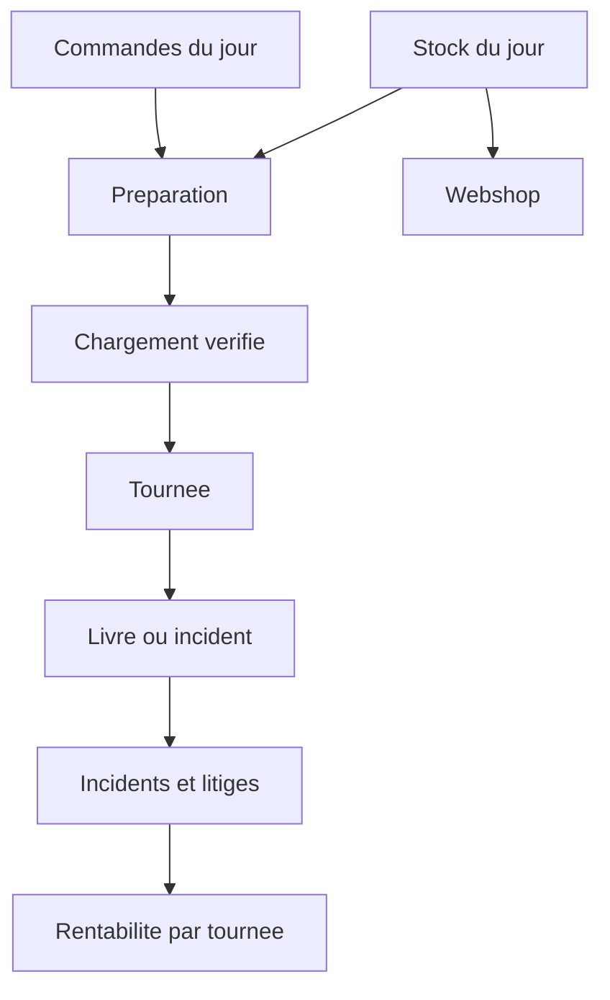

---

## Fournisseur

`fournisseurs` · famille **Approvisionnement** · ordre 4 · 8 fonctions

**Leviers** — F Food Cost · O Overhead

**Public visé** — Ateliers de production et fournisseurs du réseau

**Accroche** (85 car.) — L'atelier de production : matières, recettes, coût de revient et commandes du réseau.

**Résumé** (300 car.)

Le module que fait tourner l'atelier qui produit pour le réseau. Il tient la chaîne complète : matières premières, recettes et fiches techniques, coût de revient, puis catalogue et liste de prix négociée client par client. Les commandes des points de vente arrivent dedans, la logistique les expédie.

**Phrase d'onboarding** — Le point de départ de la marge. Vous saisissez les matières et les recettes, le coût de revient en découle, et la grille tarifaire de chaque point de vente cesse d'être un pari.

### Ce que ce module fait disparaître

- **Un coût de revient approximatif** — Sans lien entre les matières et les recettes, le prix de vente se fixe au ressenti. Une référence peut se vendre à perte pendant des mois.
- **Des tarifs qui vivent dans des fichiers** — Chaque client a sa grille, dans un tableur, dans un PDF, parfois dans un courriel. La renégociation annuelle devient un chantier de ressaisie.
- **Les réclamations se perdent** — Quand un retour se traite par téléphone, personne ne sait combien de fois le même défaut est revenu.

### Ce qu'il apporte

- **Une marge calculée, pas estimée** — Matières, recettes et fiches techniques donnent un coût de revient à chaque produit fabriqué.
- **Un tarif par client, tenu à jour** — La grille se saisit ou s'importe en JSON avec validation. Une renégociation annuelle prend une importation.
- **Le réseau commande sur le vrai catalogue** — Le point de vente voit ce que l'atelier propose réellement, avec son propre tarif.
- **Un dossier partagé pour les litiges** — Les réclamations sont tracées avec leur suite. Le fournisseur et le magasin parlent du même incident.

### Le menu, entrée par entrée (8)

| Entrée | Leviers | À quoi elle sert | Le gain |
| --- | --- | --- | --- |
| **Matières premières et ingrédients** `matieres` | F | Le référentiel amont : matières, ingrédients, unités et prix d'achat. C'est ce qui donne un coût de revient à chaque recette au lieu d'un prix décidé au doigt mouillé. | La marge se calcule à partir de données, pas d'intuitions. |
| **Recettes et fiches techniques** `recettes` | F E | Chaque produit fabriqué a sa recette et sa fiche technique : composants, quantités, process. La fiche sert autant à produire qu'à répondre à un client sur ce qu'il y a dedans. | Le savoir-faire est écrit, donc transmissible. |
| **Catalogue fournisseur** `catalogue` | F | Ce que l'atelier propose au réseau, avec l'accès client au catalogue : le point de vente commande sur le vrai référentiel, pas sur un PDF envoyé une fois. | Fini les commandes passées sur un tarif périmé. |
| **Liste de prix par client** `cennik` | F O | Chaque client a sa grille négociée. Elle se saisit à la main ou s'importe en JSON, validée avant écriture. | Reprendre un tarif annuel ne veut plus dire retaper deux cents lignes. |
| **Commandes des points de vente** `commandes` | F | Les commandes arrivent du réseau, sont préparées et suivies jusqu'à l'expédition, au tarif du client qui les a passées. | Le bon prix s'applique sans vérification manuelle. |
| **Logistique et expéditions** `logistique` | O | Les départs, les regroupements et ce qui part vers quel point de vente — l'écran qui dit ce qui est réellement sorti de l'atelier aujourd'hui. | L'atelier sait ce qu'il a expédié sans compter les palettes. |
| **Réclamations** `reclamations` | E | Les retours du réseau sur un produit ou une livraison, tracés avec leur suite. | Un défaut récurrent devient visible avant de coûter cher. |
| **Analyse des ventes** `analytics` | F O | Ce qui se vend, à qui, à quelle marge, sur la base des vraies commandes et des vrais coûts de revient plutôt que d'un export retravaillé. | Les décisions d'assortiment s'appuient sur la marge réelle. |

### Ce qu'il échange avec les autres modules

- envoie vers **cuisine** : les recettes, fiches techniques et coûts de revient
- reçoit de **console-franchise** : les commandes des points de vente

### Description longue

Dans un réseau qui produit, la marge se joue en amont. Tant que le coût de revient d'un produit se devine, la grille tarifaire proposée aux points de vente est un pari — et personne ne peut dire si une référence est rentable.

Le module fournisseur remonte la chaîne jusqu'aux matières premières. Chaque ingrédient a son unité et son prix d'achat, chaque produit fabriqué a sa recette et sa fiche technique. Le coût de revient en découle mécaniquement, et sert de socle aux prix négociés.

Le catalogue fournisseur est exposé aux points de vente : le magasin commande sur le vrai référentiel, pas sur un PDF envoyé une fois en début d'année. Chaque client dispose de sa grille de prix, saisie à la main ou importée en JSON avec validation avant écriture — reprendre un tarif annuel ne veut plus dire retaper deux cents lignes.

Les commandes du réseau arrivent, sont préparées, expédiées et suivies au tarif du client qui les a passées. Les réclamations reviennent au même endroit, ce qui fait que le fournisseur et le point de vente parlent du même dossier au lieu d'échanger des courriels.

### Schéma

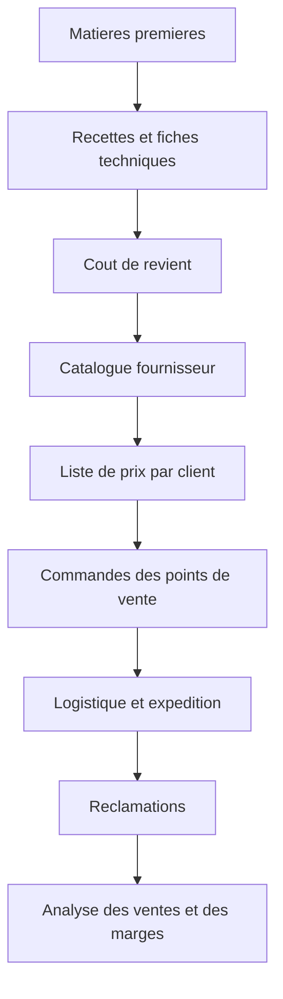

---

## Cuisine

`cuisine` · famille **Terrain** · ordre 5 · 7 fonctions

**Leviers** — E Expérience · F Food Cost · L Labour

**Public visé** — Équipes de production en point de vente

**Accroche** (85 car.) — L'application du plan de travail : production du jour, checklists, fiches techniques.

**Résumé** (249 car.)

Une application installable, tenue à une main derrière le plan de travail. Elle dit à l'équipe ce qu'il faut produire aujourd'hui, dans quel ordre, avec les fiches produit et les recettes à portée. Les checklists remplacent les feuilles plastifiées.

**Phrase d'onboarding** — Installable depuis le navigateur, sans informatique sur place. L'équipe voit ce qu'il y a à produire et coche ses contrôles ; chaque case porte un nom et une heure.

### Ce que ce module fait disparaître

- **Le savoir-faire part avec la personne** — Quand les recettes et les tours de main ne sont écrits nulle part, le départ d'un responsable coûte des mois de réapprentissage.
- **Des contrôles impossibles à prouver** — Une case cochée sur une feuille plastifiée, sans nom ni heure, ne vaut rien le jour où il faut démontrer qu'une procédure est suivie.
- **La production travaille sur une recopie** — Recopier les commandes du matin introduit des erreurs, et personne ne sait laquelle des deux listes fait foi.

### Ce qu'il apporte

- **Les procédures vivent dans l'outil** — Recettes, fiches techniques et checklists sont au poste de travail. Le savoir-faire ne dépend plus d'une personne.
- **Des contrôles prouvables** — Chaque tâche cochée porte un nom et une heure. Ce qui a été fait est démontrable sans classeur.
- **La commande réelle, pas sa copie** — La cuisine travaille sur la commande du client telle qu'elle a été passée.
- **Aucune installation à gérer** — L'app s'installe depuis le navigateur, sans boutique d'applications ni intervention informatique.

### Le menu, entrée par entrée (7)

| Entrée | Leviers | À quoi elle sert | Le gain |
| --- | --- | --- | --- |
| **Production du jour** `production` | L F | Ce qu'il y a à faire aujourd'hui, avec l'avancement par tâche : à faire, en cours, terminé. Le tableau de bord ouvre sur cet état, pas sur un menu. | L'équipe voit l'essentiel en déverrouillant l'écran. |
| **Checklists de poste** `checklists` | E | Les contrôles d'ouverture, de service et de fermeture cochés dans l'app, horodatés et attribués. | Ce qui a été fait est prouvable sans classeur. |
| **Produits et recettes** `fiches` | E F | La base de connaissances de la cuisine : fiche produit, recette, fiche technique. Le même contenu que celui tenu par le fournisseur, consulté au poste de travail. | Une recette nouvelle arrive au poste sans réimpression. |
| **Commandes à produire** `commandes` | L | Les commandes qui concernent la cuisine, avec leur détail. La cuisine travaille sur la commande réelle du client, pas sur une recopie. | Une erreur de recopie en moins entre le client et le four. |
| **Clients servis** `clients` | R | Qui est livré, avec quelles particularités. Utile quand une commande B2B revient chaque semaine avec ses contraintes. | Les habitudes d'un client régulier ne se redécouvrent pas. |
| **Réclamations** `reclamations` | E | Un problème constaté en production se déclare sur place, avec son motif. Il part vers le fournisseur ou le siège au lieu de rester dans un carnet. | Le défaut remonte le jour où il est vu. |
| **Installable et hors ligne** `hors-ligne` | O | L'app s'installe sur le téléphone ou la tablette de la cuisine depuis le navigateur, sans boutique d'applications ni intervention IT, et supporte les coupures réseau du magasin. | Déployer un magasin de plus ne demande aucune informatique sur place. |

### Ce qu'il échange avec les autres modules

- reçoit de **console-franchise** : les commandes du jour et le stock
- reçoit de **fournisseurs** : les recettes et les fiches techniques
- envoie vers **livraison** : ce qui est prêt à charger

### Description longue

La cuisine d'un point de vente fonctionne encore, dans la plupart des réseaux, avec des feuilles imprimées le matin et un classeur de fiches techniques que personne ne rouvre. Quand le responsable change, la moitié du tour de main part avec lui.

L'application cuisine tient sur le téléphone ou la tablette du poste. Elle ouvre sur ce qu'il y a à produire aujourd'hui, avec l'avancement par tâche — à faire, en cours, terminé — plutôt que sur un menu. Les commandes réelles des clients sont là, pas une recopie.

Les checklists d'ouverture, de service et de fermeture se cochent dans l'app, horodatées et attribuées. La différence avec la feuille plastifiée n'est pas le confort : c'est qu'un contrôle coché sans nom ni heure ne prouve rien, et qu'un réseau qui veut être transmissible doit pouvoir montrer que ses procédures sont réellement suivies.

Les fiches produit et les recettes viennent du même référentiel que celui tenu par le fournisseur. Une nouvelle recette arrive au poste de travail sans réimpression, et un problème constaté en production se déclare sur place au lieu de rester dans un carnet.

### Schéma

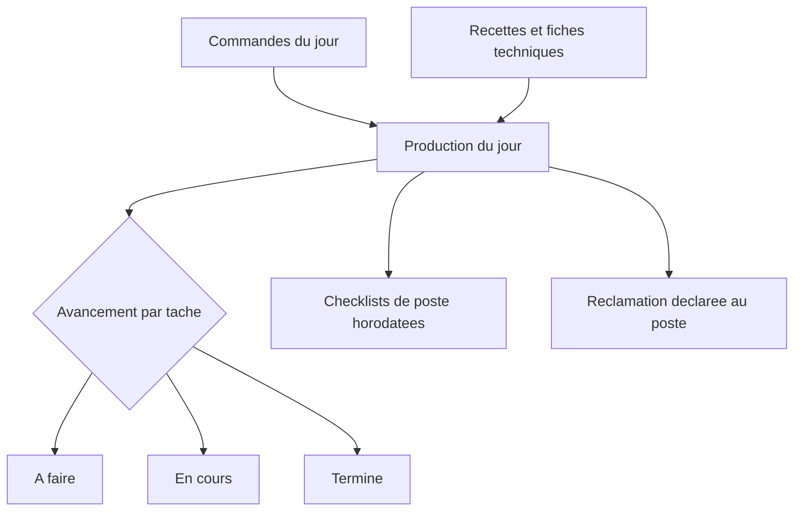

---

## Panel consultant

`consultant` · famille **Terrain** · ordre 6 · 7 fonctions

**Leviers** — T Trafic · R Récurrence · E Expérience · F Food Cost · L Labour · O Overhead

**Public visé** — Animateurs réseau et responsables d'exploitation

**Accroche** (89 car.) — L'application terrain des animateurs réseau : visites, checklists notées, comptes rendus.

**Résumé** (270 car.)

L'animateur réseau passe sa journée en magasin, pas devant un tableur. Le panel lui donne son agenda de visites, les checklists à passer point de vente par point de vente, et de quoi noter et commenter chaque tâche vérifiée — avec le nom du vérificateur et l'horodatage.

**Phrase d'onboarding** — L'outil de l'animateur réseau. Il prépare sa visite, la passe checklist par checklist, et repart avec un compte rendu déjà écrit. Les 6 leviers sont l'ossature de la conversation avec le franchisé.

### Ce que ce module fait disparaître

- **Des visites sans trace exploitable** — Un compte rendu rédigé de mémoire trois jours après la visite perd l'essentiel. Ce qui n'est pas noté sur place n'existe pas.
- **« Vérifié » par personne** — Un contrôle sans nom ni horodatage ne prouve rien. Le jour où il faut démontrer qu'un standard est appliqué, il n'y a rien à montrer.
- **La discussion tourne au ressenti** — Sans objectifs ni tendance sous les yeux, l'échange avec le franchisé se joue sur des impressions et se rejoue à chaque visite.

### Ce qu'il apporte

- **Le contrôle devient une preuve** — Chaque tâche vérifiée porte une note, un commentaire, un nom et une heure.
- **Zéro ressaisie après la visite** — Le compte rendu se construit à partir de ce qui a été relevé sur place, et se valide côté propriétaire.
- **Une conversation appuyée sur des chiffres** — Objectifs, tendance et leviers sur le même écran que la checklist.
- **La mémoire du magasin se conserve** — Ce qui restait ouvert à la visite précédente est retrouvé à la suivante, quel que soit l'animateur.

### Le menu, entrée par entrée (7)

| Entrée | Leviers | À quoi elle sert | Le gain |
| --- | --- | --- | --- |
| **Agenda des visites** `agenda` | O | Les visites planifiées par point de vente, préparées avant de partir et retrouvées sur place. L'animateur sait ce qu'il va voir et ce qu'il a laissé ouvert la dernière fois. | Rien ne se perd entre deux passages. |
| **Checklists de visite notées** `checklists` | E | Chaque tâche du magasin est vérifiée, notée et commentée, et la revue porte le nom de son auteur et son horodatage. | Le contrôle devient démontrable, pas déclaratif. |
| **Objectifs, tendances et leviers** `objectifs` | T R | Les cibles par indicateur et par magasin, la tendance sur la période, et les leviers identifiés pour la corriger. | La discussion avec le franchisé porte sur des chiffres. |
| **Réclamations matériel** `reclamations` | O | Ce qui est cassé ou manquant se déclare pendant la visite, sur plusieurs magasins d'un coup quand le même problème revient dans le réseau. | Un défaut de série se traite en une fois. |
| **Comptes rendus de visite** `rapports` | L | Le compte rendu se construit à partir de ce qui a été vérifié sur place, et se valide côté propriétaire. | Personne ne retape la visite le soir. |
| **Notes de terrain** `notes` | E | Les remarques prises au passage, rattachées au magasin et retrouvées à la visite suivante — plutôt qu'un carnet qui reste dans la voiture. | La mémoire du magasin survit au changement d'animateur. |
| **Installable et plein écran** `kiosque` | O | L'app s'installe depuis le navigateur et s'ouvre sans barre d'adresse. Sur un écran fixe en magasin, elle se lance en mode kiosque. | Un poste de plus se met en service en quelques minutes. |

### Ce qu'il échange avec les autres modules

- envoie vers **console-marque** : les visites notées et les leviers à travailler
- reçoit de **console-franchise** : les chiffres du magasin visité

### Description longue

L'animation réseau est le métier qui décide si une enseigne tient ses standards. C'est aussi celui qui se pratique le plus souvent sans outil : un carnet dans la voiture, un tableur le soir, et un compte rendu rédigé de mémoire trois jours plus tard.

Le panel consultant met la visite au centre. L'agenda liste les points de vente à voir, avec ce qui avait été laissé ouvert la fois précédente. Sur place, les checklists se passent tâche par tâche : chacune est vérifiée, notée et commentée, et la revue porte le nom de son auteur et son horodatage.

Ce détail est l'essentiel du module. « Vérifié » sans savoir par qui ni quand ne vaut rien — ni pour corriger, ni pour prouver, ni pour transmettre. Un réseau dont les contrôles sont datés et signés peut démontrer à un repreneur que ses standards existent ailleurs que dans le discours.

Les objectifs par indicateur, la tendance sur la période et les leviers identifiés sont sur le même écran : la conversation avec le franchisé s'appuie sur ces trois vues plutôt que sur une impression. Le compte rendu se construit à partir de ce qui a été réellement vérifié sur place, et se valide côté propriétaire. Personne ne retape la visite le soir.

### Schéma

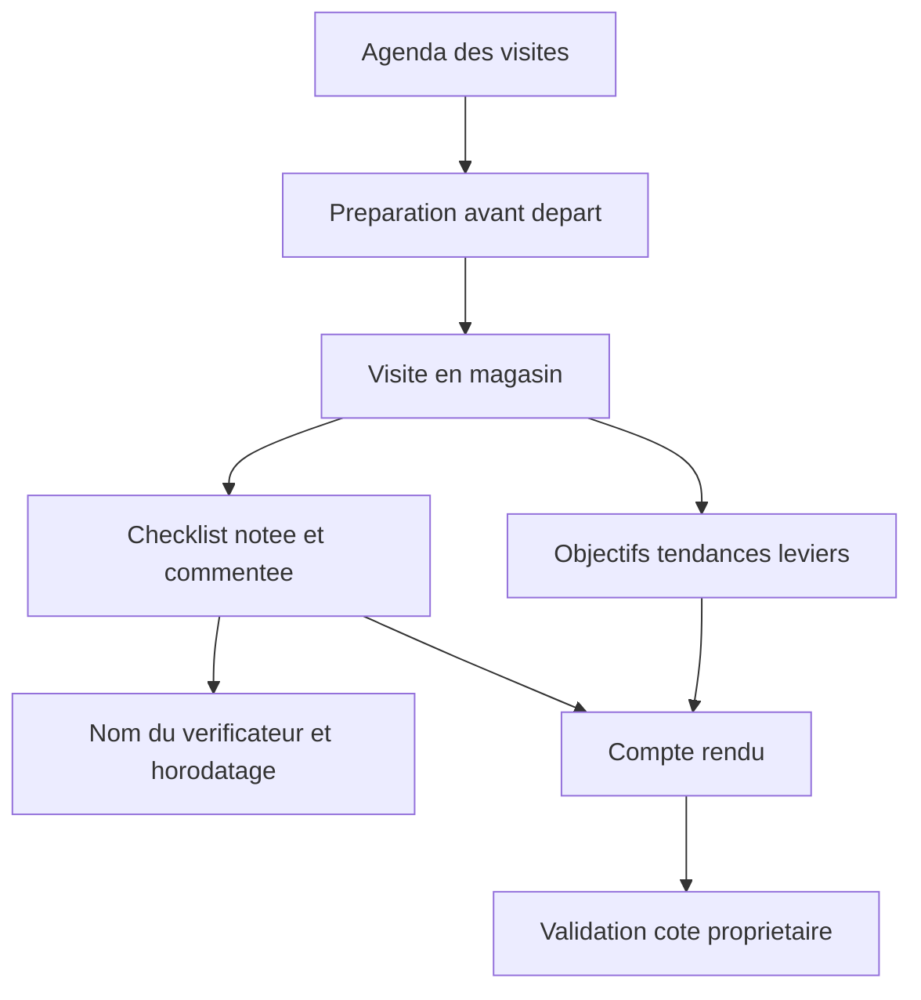

---

## Tournées de livraison

`livraison` · famille **Approvisionnement** · ordre 7 · 6 fonctions

**Leviers** — E Expérience · L Labour · O Overhead

**Public visé** — Chauffeurs livreurs, salariés ou sous-traitants

**Accroche** (94 car.) — L'application tablette du chauffeur : chargement vérifié, tournée guidée, preuve de livraison.

**Résumé** (236 car.)

Une tablette partagée au dépôt, une session liée à la tournée du jour. Le chauffeur vérifie son chargement au scan, suit un ordre de passage qui ne bouge plus, et repart de chaque point avec une preuve datée. Tout fonctionne hors ligne.

**Phrase d'onboarding** — Une tablette au dépôt, une session par tournée. Le double scan bloque un départ incomplet et chaque point de livraison laisse une preuve datée. Fonctionne sans réseau.

### Ce que ce module fait disparaître

- **Le manquant se découvre chez le client** — Sans contrôle au chargement, l'erreur se constate à l'arrivée. Le magasin refait la course ou perd la commande.
- **Un litige contre une parole** — Sans preuve datée et localisée, chaque contestation de livraison se règle au bénéfice du doute — toujours le même qui paie.
- **Des motifs en texte libre** — Quand chaque chauffeur décrit l'incident à sa façon, le siège ne peut ni compter ni comparer.
- **Le réseau coupe, la tournée s'arrête** — Une application qui exige la connexion devient inutilisable en zone blanche, c'est-à-dire là où se font les livraisons.

### Ce qu'il apporte

- **Le départ bloqué sur emport incomplet** — Le double scan confronte le chargement au bon préparé. L'erreur se corrige au dépôt, pas chez le client.
- **Une preuve à chaque point** — Photo géolocalisée et confirmation du client par QR, avec repli sur PIN, signature ou photo seule.
- **Des incidents comparables** — Motifs codifiés, décision et preuve jointe. Le siège lit des chiffres, pas des récits.
- **Utilisable en zone blanche** — La tournée tient dans la tablette. Les écritures repartent à la reconnexion, sans doublon.

### Le menu, entrée par entrée (6)

| Entrée | Leviers | À quoi elle sert | Le gain |
| --- | --- | --- | --- |
| **Tournée du jour** `tournee` | E L | La tournée assignée s'ouvre avec ses chiffres : colis à livrer, points de passage, heure de départ et ETA de fin. L'ordre de passage est figé, il ne se réordonne pas en cours de route. | Le magasin et le client savent quand la livraison passe. |
| **Chargement en double scan** `chargement` | F L | Le chauffeur scanne ce qu'il embarque, l'app le confronte au bon préparé par le magasin. Les manquants sont listés par client et le départ reste bloqué tant que l'emport est incomplet. | L'erreur se corrige au dépôt, pas chez le client. |
| **Preuve de livraison** `livraison` | E | À chaque point : dépôt scanné, photo géolocalisée, puis un QR qui tourne et que le client scanne pour confirmer. Repli sur code PIN, signature ou photo seule. | Un litige se tranche sur une preuve datée. |
| **Incidents codifiés** `incident` | E O | Client absent, adresse fermée, colis abîmé : le chauffeur choisit un motif dans une liste fermée, décide de la suite et joint la preuve. | Le siège lit des motifs comparables entre tournées. |
| **Hors ligne par défaut** `hors-ligne` | L | La tournée entière tient dans la tablette. Sans réseau, le chauffeur continue à scanner, photographier et clôturer ; les écritures partent à la reconnexion, dans l'ordre, sans doublon. | La zone blanche n'interrompt plus la tournée. |
| **Salarié ou sous-traitant** `contrat` | O L | Le même écran sert les deux statuts : le chauffeur salarié voit son pointage de service, le sous-traitant ne l'a pas. Le type de contrat est porté par la session. | Une seule application à maintenir pour les deux modèles. |

### Ce qu'il échange avec les autres modules

- reçoit de **console-franchise** : la tournée assignée et le bon préparé
- envoie vers **console-franchise** : les preuves datées et les incidents codifiés

### Description longue

La livraison est l'endroit où un réseau perd de l'argent sans le voir. Un colis manquant se découvre chez le client, un litige se règle au téléphone contre la parole du chauffeur, et personne ne sait combien de fois le cas s'est reproduit ce mois-ci.

L'application impose deux points de contrôle. Au départ, le double scan : le chauffeur scanne ce qu'il embarque, l'app le confronte au bon préparé par le magasin, les manquants sont listés par client, et le départ reste bloqué tant que l'emport est incomplet — sauf dérogation, elle aussi journalisée avec son auteur.

À l'arrivée, la preuve : dépôt scanné, photo géolocalisée, puis un QR code qui tourne et que le client scanne pour confirmer la réception. Si le client n'a pas de téléphone, la preuve retombe sur un code PIN, une signature ou la photo seule. Les incidents se choisissent dans une liste fermée de motifs, jamais en texte libre, pour que le siège lise des chiffres comparables entre tournées.

Le tout fonctionne hors ligne par construction. La tournée entière tient dans la tablette ; sans réseau, le chauffeur continue à scanner, photographier et clôturer. Les écritures partent à la reconnexion, dans l'ordre, chacune avec une clé d'idempotence pour qu'un rejeu ne crée jamais de doublon.

### Schéma

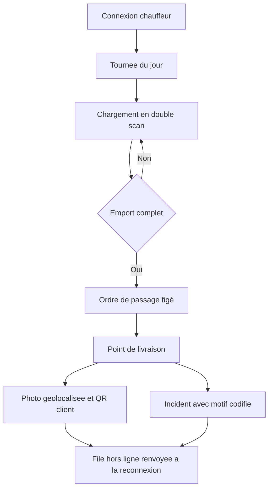

---

## Régie d'affichage

`affichage` · famille **Vente** · ordre 8 · 6 fonctions

**Leviers** — T Trafic · R Récurrence · E Expérience

**Public visé** — Marketing réseau et responsables de point de vente

**Accroche** (74 car.) — Les écrans du magasin pilotés depuis un seul back office, jusqu'au player.

**Résumé** (271 car.)

Un magasin affiche des prix, des promos et des menus sur ses écrans. La régie remplace le montage vidéo et la clé USB : on construit un film à partir de la base produits, on le planifie par période, on le pousse sur les écrans du réseau, et chaque écran remonte son état.

**Phrase d'onboarding** — Vos écrans cessent d'être un montage vidéo. Le film se construit sur la base produits, se planifie par tranche horaire, et chaque écran remonte ce qu'il affiche vraiment.

### Ce que ce module fait disparaître

- **Le prix à l'écran est faux** — Quand l'affichage est monté à la main, il dérive du catalogue dès la première promotion. Le client voit un prix, la caisse en applique un autre.
- **Une opération commerciale prend des semaines** — Monter, copier et distribuer une vidéo par magasin fait qu'une campagne nationale n'est jamais lancée partout le même jour.
- **Personne ne sait ce qui est affiché** — Sans remontée des écrans, un player éteint ou bloqué sur l'ancienne campagne passe inaperçu pendant des semaines.

### Ce qu'il apporte

- **Le tarif affiché vient du catalogue** — Les listes de prix sont liées à la table produits. Un changement se propage sans ressaisie.
- **Une campagne bascule d'un coup** — Les éléments taggés en campagne s'activent ensemble, sur les écrans choisis.
- **Ce qui est affiché est vérifiable** — Chaque player remonte un battement de cœur et une capture. L'écran décroché est signalé.
- **L'affichage s'adapte à l'heure** — Les périodes de la journée déclenchent le bon film sur l'horloge du magasin.

### Le menu, entrée par entrée (6)

| Entrée | Leviers | À quoi elle sert | Le gain |
| --- | --- | --- | --- |
| **Compositeur de film** `compositeur` | T | La bibliothèque d'éléments — catégories, liaisons, promos — et la playlist qui en fait un film. Mise en page, mouvement, filigrane et jetons dynamiques se règlent élément par élément. | Un montage vidéo de moins à sous-traiter. |
| **Produits et tarifs affichés** `produits` | T F | Les listes de prix à l'écran sont liées à la table produits, pas retapées. Un changement de prix se propage au prochain film. | Le prix vu par le client est celui de la caisse. |
| **Campagnes et promotions** `campagnes` | T R | Les opérations commerciales sont taguées en campagne : on active une campagne et tous les éléments qui la portent basculent d'un coup, sur les écrans choisis. | Une opération nationale démarre partout le même matin. |
| **Périodes et planning de diffusion** `planning` | T | Le petit-déjeuner, le service du midi et le goûter n'affichent pas la même chose. Les périodes décrivent ces plages et le planning dit quel film passe quand. | L'écran vend ce qui est disponible à cette heure-là. |
| **Réseau et supervision des écrans** `reseau` | O | Chaque écran est un player authentifié par jeton qui envoie un battement de cœur et une capture. La supervision montre magasin par magasin ce qui est réellement affiché. | Un écran décroché se voit le jour même. |
| **Visionneuse publique** `film` | E | La dernière playlist publiée est consultable en plein écran sans connexion, à l'adresse /film. | Le responsable vérifie l'affichage depuis son téléphone. |

### Ce qu'il échange avec les autres modules

- reçoit de **console-marque** : le catalogue, les tarifs et les campagnes

### Description longue

Les écrans en magasin sont le dernier endroit où le prix affiché ne vient de nulle part. Quelqu'un monte une vidéo, la copie sur une clé USB, fait le tour des boutiques — et six semaines plus tard trois magasins affichent encore l'ancienne promotion.

La régie relie l'affichage à la base produits. Les listes de prix à l'écran sont liées à la table catalogue, pas retapées : un changement de tarif se propage au film suivant sans repasser par un logiciel de montage. Les jetons dynamiques — nom du magasin, date, saison — se résolvent à l'affichage, donc un même élément sert tout le réseau.

Le compositeur assemble une bibliothèque d'éléments en playlist : mise en page, mouvement, filigrane, réglés élément par élément. Les périodes décrivent les plages de la journée — le petit-déjeuner, le service du midi, le goûter n'affichent pas la même chose — et le planning dit quel film passe quand, sur l'horloge du magasin.

Chaque écran est un player authentifié par jeton qui envoie un battement de cœur et une capture. La supervision montre, magasin par magasin, ce qui est réellement affiché, et signale l'écran qui a décroché. La dernière playlist publiée est aussi consultable en plein écran à l'adresse publique, ce qui permet à un responsable de vérifier depuis son téléphone.

### Schéma

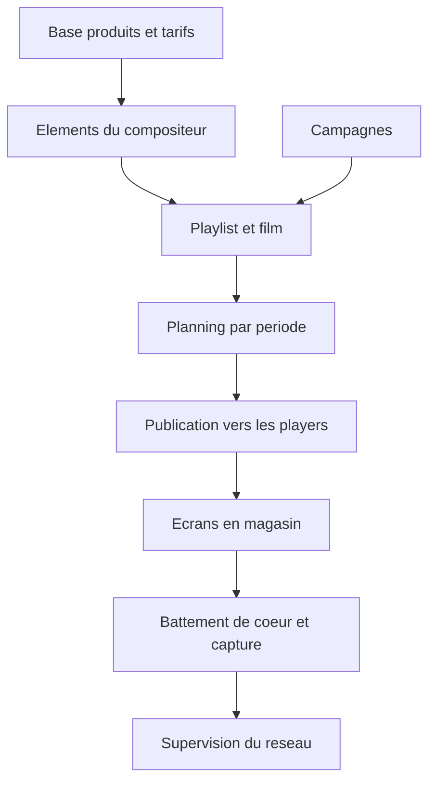

---

## Recrutement de franchisés

`recrutement` · famille **Développement** · ordre 9 · 22 fonctions

**Leviers** — O Overhead · E Expérience · T Trafic

**Public visé** — Direction du développement, consultants recrutement, candidats franchisés

**Accroche** (68 car.) — Du premier clic sur l'annonce à la signature, un seul dossier suivi.

**Résumé** (320 car.)

Recruter un franchisé prend six à dix-huit mois et passe par une trentaine d'échanges. Ce module tient les quatre faces de ce parcours au même endroit : la page publique qui capte les candidatures, le CRM qui suit les étapes, l'espace où le candidat avance seul, et la vue du propriétaire qui dit ce que tout cela coûte.

**Phrase d'onboarding** — C'est ici qu'un réseau grandit. Le candidat entre par l'annonce, avance seul entre deux rendez-vous, et vous voyez à tout moment où il en est et ce qu'il vous coûte. Rien de tout cela ne dépend plus de la mémoire d'un recruteur.

### Ce que ce module fait disparaître

- **Le dossier vit dans une boîte mail** — Les pièces d'un candidat sont éparpillées entre des mails, un dossier partagé et la mémoire du consultant. Personne d'autre ne peut reprendre le dossier, et le réseau ne sait pas dire où en est un candidat sans appeler quelqu'un.
- **Le candidat attend, et se refroidit** — Entre deux rendez-vous, un candidat n'a rien à faire ni rien à lire. Le délai devient un signal négatif : celui qui abandonne au troisième mois est souvent celui qui n'avait simplement plus de nouvelles.
- **La méthode de recrutement ne se transmet pas** — Les étapes, les questions à poser, les documents à réclamer sont dans la tête du recruteur. Un départ, et le réseau réapprend son propre processus — au moment précis où il voudrait accélérer son développement.
- **Le coût d'une signature est inconnu** — Salons, publicité, temps consultant, primes : les dépenses de recrutement sont réelles mais jamais rapportées au nombre de signatures. Le réseau investit sans savoir ce qu'il paie pour un franchisé.

### Ce qu'il apporte

- **Un candidat, un dossier, quatre vues** — La page publique, le CRM, l'espace candidat et la vue du propriétaire lisent la même donnée, reliée par l'adresse e-mail. Le formulaire crée les trois enregistrements d'un coup.
- **Le candidat avance sans vous** — Vidéothèque, documents à lire, carte des emplacements, simulateur de financement, créneaux de rendez-vous : entre deux échanges, il progresse seul et vous le voyez progresser.
- **Le parcours est un paramétrage** — Étapes, ordre, caractère bloquant, documents exigés et e-mail déclenché se règlent dans l'interface. La méthode du réseau est écrite quelque part, donc reprenable.
- **Le coût par signature est un chiffre** — Fixe, primes, publicité, foires et campagnes sont additionnés et rapportés aux candidats et aux signatures. Le développement se pilote comme le reste du réseau.
- **Les documents se génèrent et se relisent** — Publipostage à partir de modèles à variables, annexes fixes, signature électronique, puis lecture assistée des pièces reçues avec synthèse et alertes.

### Le menu, entrée par entrée (22)

| Entrée | Leviers | À quoi elle sert | Le gain |
| --- | --- | --- | --- |
| **Page franchise publique** `landing` | T | La page qui présente l'enseigne aux candidats : carrousels photos et vidéos, carte des emplacements, formulaire de contact. Tout son contenu vient de la base — aucune ligne à modifier pour changer une diapositive. | Le développement publie son annonce sans passer par un développeur. |
| **Candidatures entrantes** `leads` | T O | Chaque envoi du formulaire est archivé tel quel, et crée en même temps le compte du portail et la fiche CRM. La trace brute n'est jamais effacée : c'est la sauvegarde de secours des candidatures. | Aucune candidature ne se perd entre deux outils. |
| **Étapes du parcours** `parcours` | O | Les étapes du recrutement, leur ordre, celles qui bloquent la suite, les documents qu'elles réclament et l'e-mail qu'elles déclenchent. Le processus du réseau est décrit ici, pas dans une note de service. | La méthode de recrutement survit au départ du recruteur. |
| **Fiches candidats** `candidats` | O | Le dossier de chaque candidat : coordonnées, zone visée, étape courante, notes privées ou partagées, documents reçus par étape, motif de clôture. | N'importe quel consultant reprend un dossier en trois minutes. |
| **Emplacements et zones** `emplacements` | T O | Une seule table sert les trois fronts : la liste déroulante du formulaire, les épingles de la carte publique et le carrousel d'opportunités du portail. Boutique existante, zone disponible ou zone ciblée sont distinguées. | Une zone ouverte au recrutement se déclare une seule fois. |
| **Publipostage et contrats** `publipostage` | O | Des modèles de documents à variables — DIP, contrat, bail — remplis avec les données du candidat, avec leurs annexes PDF fixes. Le document part complet du premier coup. | Une heure de mise en forme par dossier en moins. |
| **Signature électronique** `signature` | O E | Envoi à signer, relance et retour du document signé rattaché à l'étape. Le statut de signature est visible dans le dossier, pas dans la boîte mail de quelqu'un. | Le délai de signature cesse d'être un angle mort. |
| **Lecture assistée des documents** `lecture-ia` | O | Les pièces reçues sont analysées : synthèse, champs extraits, alertes sur ce qui manque ou détonne. Le consultant relit une synthèse au lieu de trente pages. | Les pièces d'un dossier se contrôlent en quelques minutes. |
| **Lexique documentaire** `lexique` | O | La bibliothèque des types de documents du réseau — ce qu'est un DIP, ce que contient un contrat, quelle pièce sert à quoi — organisée et consultable par les consultants. | Un consultant qui arrive sait quoi demander, et pourquoi. |
| **Rendez-vous et Google Calendar** `rdv` | O E | Les rendez-vous du parcours, leur lieu, leur statut, et leur synchronisation avec l'agenda du consultant. Le candidat réserve depuis son espace, le consultant les voit dans son calendrier. | Plus d'aller-retour de dix messages pour caler une date. |
| **Messagerie intégrée** `messagerie` | E O | Les e-mails envoyés et reçus sont journalisés dans le dossier du candidat, avec les modèles automatiques — dont l'accusé de réception sous 48 heures. | L'historique de la relation est dans le dossier, pas dans une boîte personnelle. |
| **Espace candidat** `espace-candidat` | E | Le portail du candidat, en deux niveaux : découverte à l'inscription, puis accès complet une fois le dossier validé. Ce que le candidat peut voir dépend de son avancement, pas d'un envoi manuel. | Le candidat a quelque chose à faire entre deux rendez-vous. |
| **Parcours en 8 étapes** `journey` | E | Le suivi visuel côté candidat : les huit étapes, la barre d'avancement, et surtout la prochaine action attendue de lui. | Le candidat sait toujours ce qu'on attend de lui. |
| **Vidéothèque et quiz** `videotheque` | E | Les vidéos de présentation du réseau, avec leur progression de visionnage, puis un quiz qui vérifie ce qui a été compris et débloque un badge. | La présentation du concept ne repose plus sur une réunion. |
| **Collection de badges** `badges` | E | Neuf badges gagnés au fil du parcours. Un candidat engagé dans une collection est un candidat qui revient, et sa progression est un signal lisible pour le consultant. | L'engagement du candidat devient mesurable. |
| **Carte des emplacements** `carte` | E T | La carte du territoire vue par le candidat : boutiques existantes, zones disponibles, zones ciblées, avec le détail de chaque emplacement et un carrousel des opportunités d'ouverture. | Le candidat se projette sur un territoire réel, pas sur une promesse. |
| **Financement et investisseurs** `investisseurs` | E O | Les partenaires financiers du réseau et un simulateur d'apport et de mensualité. Le candidat teste son plan avant le premier rendez-vous bancaire. | La question de l'argent se pose tôt, sur des chiffres. |
| **Créneaux réservables** `agenda` | E | Les disponibilités du consultant groupées par jour, réservables depuis l'espace candidat, plus la journée découverte réservée aux dossiers validés. | Le rendez-vous se prend quand le candidat y pense, pas trois jours plus tard. |
| **Dossier de candidature** `candidature` | O E | Le formulaire détaillé — apport, expérience, motivation, zone. Son envoi valide le dossier, débloque le niveau 2 du portail et bascule la fiche CRM. | Le passage à l'étape suivante est déclenché par le candidat, pas relancé par vous. |
| **Bilan du propriétaire** `bilan` | O | Une vue en lecture seule, sur téléphone : candidats actifs, en attente, signés, abandonnés, répartition par étape et par zone, motifs d'abandon, candidatures des 7 et 30 derniers jours. | Le propriétaire suit son développement sans ouvrir le CRM. |
| **Coût du recrutement** `couts` | O | Fixe, primes de signature, publicité, foires et salons, campagnes par prestataire — additionnés puis rapportés au nombre de candidats et de signatures. | On sait enfin ce que coûte un franchisé recruté. |
| **Comptes et journal de connexion** `acces` | O | Les comptes consultants avec leur rôle, révocables, et le journal de chaque connexion, échec et déconnexion avec l'adresse et le navigateur. | L'accès aux dossiers candidats est traçable. |

### Ce qu'il échange avec les autres modules

- envoie vers **console-marque** : le franchisé signé et sa zone, prêts à devenir un point de vente
- reçoit de **console-marque** : les emplacements ciblés par l'analyse géographique du réseau
- envoie vers **consultant** : le nouveau franchisé à accompagner sur ses premières visites

### Description longue

Le recrutement de franchisés est le processus le plus mal outillé des réseaux, et le plus déterminant : c'est lui qui décide qui portera l'enseigne pendant dix ans. Dans la plupart des réseaux il vit dans une boîte mail, un tableur et la mémoire d'un consultant. Quand ce consultant part, la moitié des dossiers en cours devient illisible.

Ce module part du constat qu'un candidat traverse quatre surfaces, et qu'elles doivent raconter la même chose. La page publique présente l'enseigne, ses emplacements disponibles et son formulaire. Le CRM suit le dossier étape par étape, avec les documents attendus à chaque étape. L'espace candidat laisse la personne avancer seule — lire, regarder, simuler son financement, réserver un rendez-vous — sans mobiliser un consultant pour chaque question. Et la vue du propriétaire dit, en lecture seule, combien de candidats sont dans le tuyau, où ils bloquent, et ce que coûte une signature.

La liaison entre les quatre est l'adresse e-mail. Un envoi du formulaire crée d'un coup la trace brute du lead, le compte du portail candidat et la fiche CRM à l'étape « dossier reçu ». Aucune ressaisie, et surtout aucun candidat qui existe dans un outil mais pas dans l'autre.

Le parcours candidat n'est pas figé dans le code : les étapes, leur ordre, leur caractère bloquant, les documents qu'elles exigent et l'e-mail qu'elles déclenchent se paramètrent. Un réseau qui change sa méthode de recrutement change son paramétrage, pas son logiciel — et c'est précisément ce qui rend la méthode transmissible à un nouveau directeur du développement.

Les emplacements sont une table unique servie aux trois fronts : ils alimentent la liste déroulante du formulaire, les épingles de la carte publique et le carrousel d'opportunités du portail candidat. Une zone ouverte au recrutement se déclare une fois.

### Schéma

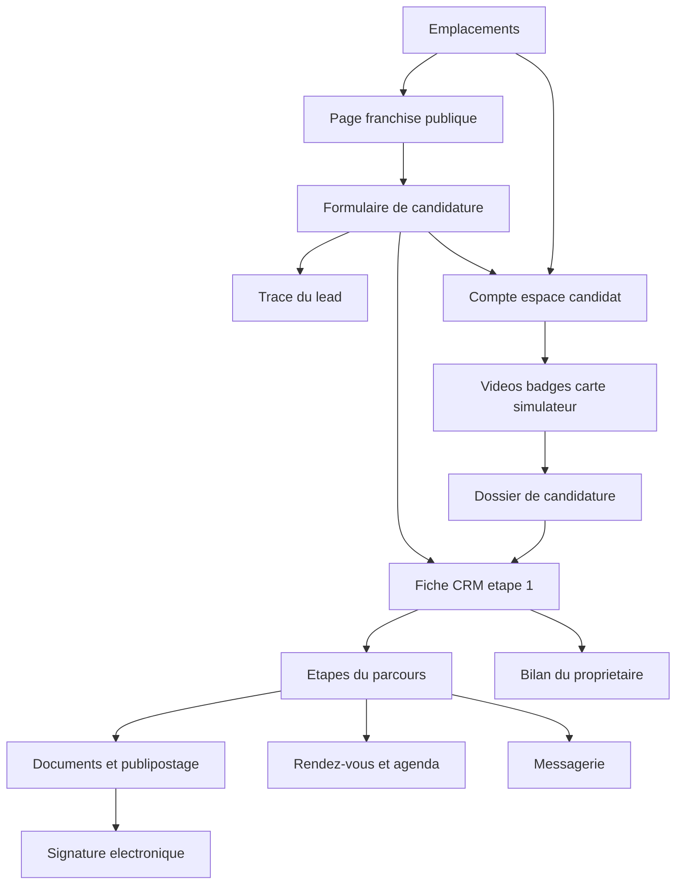

---

## Redevances

`redevances` · famille **Pilotage** · ordre 10 · 6 fonctions

**Leviers** — O Overhead · R Récurrence

**Public visé** — Direction financière du réseau

**Accroche** (81 car.) — Royalties et redevance marketing calculées, encaissées et, au besoin, bloquantes.

**Résumé** (258 car.)

Les redevances se calculent sur le chiffre réel remonté des caisses : royalties, redevance marketing, minima contractuels. L'impayé suit une escalade écrite — relance, restriction, blocage — et le paiement reçu rouvre les services sans intervention manuelle.

**Phrase d'onboarding** — À brancher dès que les ventes remontent. Le calcul part du chiffre réel, la facture part toute seule, et l'impayé suit une escalade écrite : relance, restriction, blocage — puis déblocage immédiat au paiement.

### Ce que ce module fait disparaître

- **La redevance se calcule sur du déclaratif** — Quand le franchisé déclare lui-même son chiffre, chaque facture devient une négociation. Le siège encaisse en retard, et en dessous.
- **L'impayé n'a pas de conséquence** — Sans mécanisme gradué, un impayé traîne des mois. Le franchisé qui paie à l'heure se demande pourquoi il continue.
- **Le contrat vit dans un classeur** — Taux, assiette et minima varient par contrat. Recalculés à la main chaque mois, ils finissent par diverger de ce qui est signé.

### Ce qu'il apporte

- **Calculées sur le chiffre réel** — L'assiette vient des encaissements remontés, pas d'une déclaration mensuelle.
- **Une escalade écrite** — Relance, restriction, blocage : chaque étape est une règle datée et journalisée, connue d'avance.
- **Le contrat est le paramétrage** — Taux, assiette, minima et exonérations se règlent boutique par boutique.
- **Le déblocage est immédiat** — Le paiement reçu rouvre les services sans intervention manuelle.

### Le menu, entrée par entrée (6)

| Entrée | Leviers | À quoi elle sert | Le gain |
| --- | --- | --- | --- |
| **Calcul des redevances** `calcul` | O | Royalties et redevance marketing calculées par période sur le chiffre remonté, avec taux, assiette et minima propres à chaque contrat. | La facture part juste, sans tableur. |
| **Facturation automatique** `facturation` | O | Les factures de redevances partent seules à la clôture de période, avec le détail du calcul joint. | Personne ne passe le premier du mois à facturer. |
| **Prélèvement et encaissement** `encaissement` | O | Prélèvement SEPA ou carte, rapprochement automatique du paiement et de la facture. | L'encaissement cesse d'être une relance téléphonique. |
| **Relances graduées** `relances` | O E | Les relances partent selon l'échéancier décidé au contrat, avec copie au consultant du magasin. | L'impayé se traite avant de devenir un litige. |
| **Suspension et blocage** `blocage` | O | L'impayé persistant restreint puis suspend les services selon la règle écrite : d'abord les modules de confort, jamais l'encaissement du magasin. | La conséquence est connue d'avance, donc rarement nécessaire. |
| **Journal et audit** `audit` | O | Chaque calcul, facture, relance et blocage est journalisé avec son auteur et sa règle. | Une contestation se tranche sur le journal, pas sur la mémoire. |

### Ce qu'il échange avec les autres modules

- reçoit de **pos** : les encaissements qui servent d'assiette au calcul
- envoie vers **console-marque** : l'état des paiements du réseau

### Description longue

La redevance est le revenu du franchiseur, et c'est souvent le flux le plus mal outillé du réseau : une assiette déclarée par le franchisé, un calcul refait dans un tableur, et un impayé qui traîne parce que personne ne veut déclencher le conflit.

Le module part du chiffre réel remonté des caisses. Taux, assiette, minima et exonérations sont posés dans le contrat de chaque boutique ; la facture part seule à la clôture de période, avec le détail du calcul joint. L'impayé suit une escalade écrite : relances datées, restriction des services de confort, puis blocage — jamais l'encaissement du magasin. Le paiement reçu débloque immédiatement, et chaque étape est journalisée avec son auteur et sa règle.

### Schéma

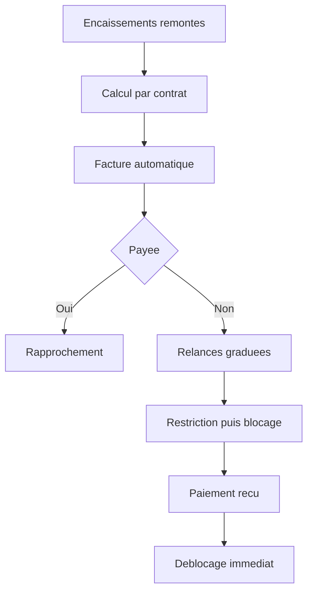

---

## Caisse POS

`pos` · famille **Vente** · ordre 11 · 6 fonctions

**Leviers** — T Trafic · R Récurrence · F Food Cost

**Public visé** — Équipes de vente en point de vente

**Accroche** (86 car.) — La caisse du magasin : bundles, promotions et encaissement reliés au catalogue réseau.

**Résumé** (232 car.)

La caisse lit le même catalogue que le webshop et les écrans : produits, bundles, promotions du siège et du magasin. L'encaissement remonte en continu — c'est lui qui alimente le tableau de bord du jour et l'assiette des redevances.

**Phrase d'onboarding** — La caisse se branche sur le catalogue existant : l'équipe retrouve les mêmes produits, bundles et promotions que le webshop, et le chiffre remonte tout seul dès le premier ticket.

### Ce que ce module fait disparaître

- **La caisse raconte sa propre histoire** — Prix retapés, promotions oubliées : ce que la caisse applique diverge du catalogue dès la première opération commerciale.
- **Le chiffre reste dans la caisse** — Le siège pilote sur des exports hebdomadaires. L'écart entre boutiques se découvre quand il est déjà installé.
- **Le bundle vit sur une affiche** — La formule mise en avant n'existe pas dans la caisse : l'équipe la reconstitue à la main, chacun à sa façon.

### Ce qu'il apporte

- **Un seul référentiel, jusqu'à la caisse** — Produits, prix, bundles et promotions viennent du catalogue réseau.
- **Le chiffre remonte en continu** — Chaque encaissement alimente le tableau de bord du jour et l'assiette des redevances.
- **Les bundles se vendent tels que conçus** — La formule construite au siège arrive en caisse prête à encaisser, avec sa marge connue.
- **La coupure ne ferme pas le magasin** — Le mode hors ligne encaisse et resynchronise à la reconnexion, sans doublon.

### Le menu, entrée par entrée (6)

| Entrée | Leviers | À quoi elle sert | Le gain |
| --- | --- | --- | --- |
| **Écran de vente** `vente` | L | L'écran d'encaissement tenu à une main : produits, formules et remises, pensé pour l'heure de pointe. | Un nouvel équipier encaisse dès son premier service. |
| **Bundles et formules** `bundles` | F T | Les formules construites au siège arrivent en caisse prêtes à vendre, avec leur prix résolu et leur marge connue. | Le bundle vendu est celui qui a été conçu. |
| **Promotions en caisse** `promotions` | T R | Les promotions du siège et du magasin s'appliquent selon les mêmes règles que le webshop, sans saisie manuelle. | Le prix en caisse est celui de l'affiche. |
| **Paiements et clôture** `encaissement` | O | Espèces, carte et titres, avec la clôture de journée rapprochée automatiquement des encaissements. | La clôture prend cinq minutes, pas une heure. |
| **Tickets et TVA** `tickets` | O | Tickets conformes, taux de TVA par produit, et le journal légal tenu sans y penser. | Le contrôle fiscal se passe sur le journal, pas dans les cartons. |
| **Hors ligne** `hors-ligne` | L | La caisse encaisse pendant une coupure réseau et resynchronise à la reconnexion, dans l'ordre, sans doublon. | La coupure ne fait plus fermer le magasin. |

### Ce qu'il échange avec les autres modules

- reçoit de **console-marque** : le catalogue, les bundles et les promotions
- envoie vers **console-franchise** : les ventes du jour, en continu
- envoie vers **redevances** : les encaissements qui servent d'assiette

### Description longue

Une caisse déconnectée du catalogue raconte sa propre histoire : un prix retapé à la main, une promotion oubliée, un bundle qui n'existe que sur l'affiche. Et comme le chiffre reste dans la caisse, le siège pilote sur des exports.

La caisse POS lit le référentiel réseau : produits, prix, formules et bundles viennent du catalogue, les promotions du siège et du magasin s'appliquent selon les mêmes règles que le webshop. L'encaissement remonte en continu vers la console du franchisé et sert d'assiette aux redevances. Le mode hors ligne encaisse pendant une coupure et resynchronise à la reconnexion, sans doublon.

### Schéma

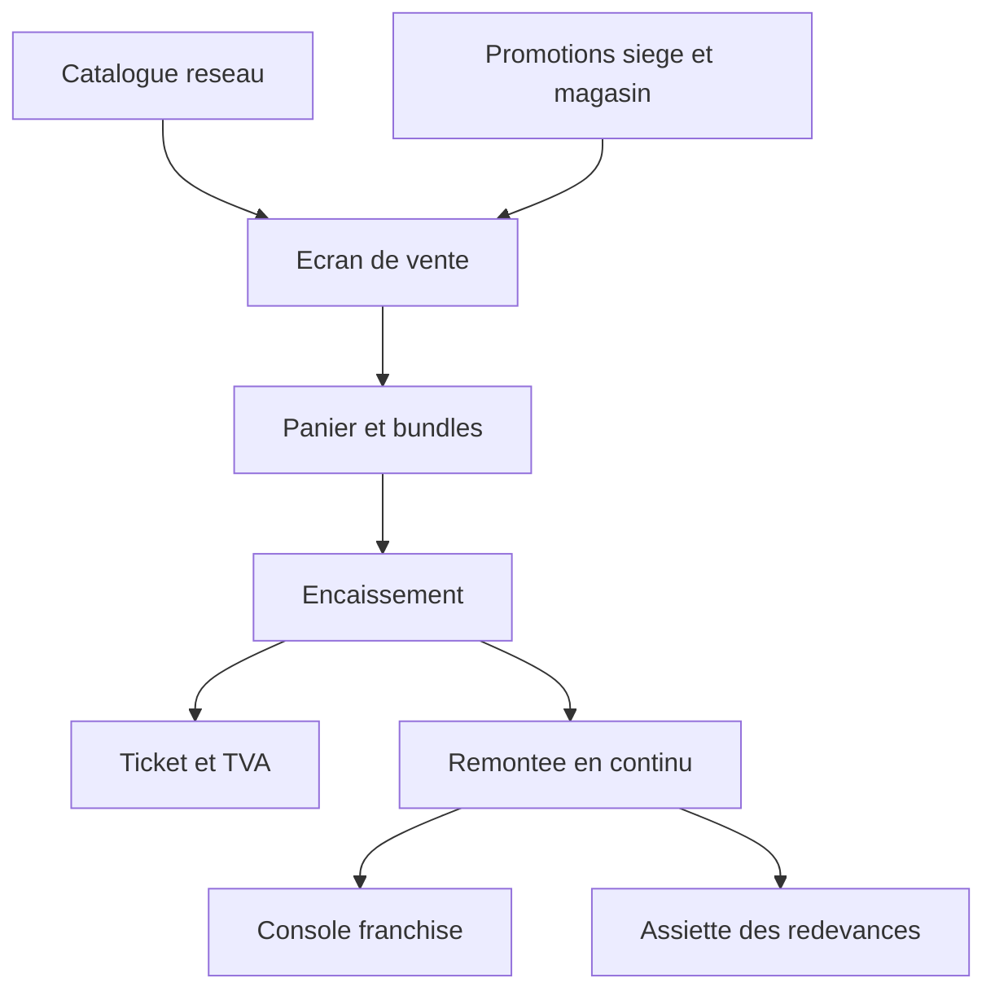

---

## Recettes & Food Cost

`recettes` · famille **Approvisionnement** · ordre 12 · 6 fonctions

**Leviers** — F Food Cost · O Overhead

**Public visé** — Direction réseau et responsables food cost

**Accroche** (86 car.) — Produits, recettes et coûts matière suivis jusqu'à la rentabilité de chaque référence.

**Résumé** (245 car.)

Chaque produit vendu est relié à sa recette et à ses coûts matière. Le food cost se suit par référence et par boutique, les dérives déclenchent une alerte, et la discussion sur les prix s'appuie sur la marge réelle plutôt que sur une impression.

**Phrase d'onboarding** — À ouvrir quand le catalogue et le fournisseur sont en place : les recettes existent déjà, le module les relie aux prix d'achat et la marge par référence apparaît sans ressaisie.

### Ce que ce module fait disparaître

- **La marge par référence n'existe nulle part** — Recettes dans un classeur, prix d'achat dans les factures : personne ne peut dire ce que rapporte réellement une référence.
- **La dérive se découvre au bilan** — Un prix d'achat qui monte ou une portion qui gonfle se voit des mois plus tard, quand la marge du trimestre est déjà consommée.
- **Le théorique ignore le réel** — Sans inventaires rapprochés, l'écart entre le food cost calculé et le food cost constaté reste une intuition.

### Ce qu'il apporte

- **Un food cost par référence** — Chaque produit vendu est relié à sa recette et à ses coûts matière réels.
- **Les dérives déclenchent une alerte** — Prix d'achat, portions, pertes : ce qui bouge au-delà du seuil se signale le jour même.
- **La rentabilité se compare** — Marge par référence, par boutique et par période — sur les mêmes règles partout.
- **Le réel rejoint le théorique** — Inventaires et pertes ferment la boucle entre la recette et ce qui sort vraiment de la cuisine.

### Le menu, entrée par entrée (6)

| Entrée | Leviers | À quoi elle sert | Le gain |
| --- | --- | --- | --- |
| **Produits et compositions** `produits` | F | Chaque produit vendu est relié à sa recette : composants, quantités, unités — la base du calcul. | Le food cost part de la recette, pas d'un ratio global. |
| **Recettes et portions** `recettes` | F E | Les fiches techniques donnent les portions théoriques ; ce qui sort de la cuisine se compare à ce qui devait sortir. | La portion qui gonfle se voit avant la fin du mois. |
| **Food cost par référence** `foodcost` | F | Le coût matière de chaque référence, recalculé quand un prix d'achat bouge, par boutique et par période. | Une référence vendue à perte se repère en jours. |
| **Marges et rentabilité** `marges` | F O | La marge réelle par référence, par famille et par boutique, sur les quantités réellement vendues. | La discussion prix s'appuie sur des chiffres. |
| **Inventaires et pertes** `inventaires` | F | Inventaires périodiques et pertes déclarées, rapprochés du théorique pour mesurer l'écart réel. | L'écart théorique-réel devient un chiffre suivi. |
| **Alertes de dérive** `alertes` | F | Un seuil par référence ou par famille : ce qui dérive — coût, portion, perte — se signale le jour même. | La marge se défend en semaine, pas au bilan. |

### Ce qu'il échange avec les autres modules

- reçoit de **fournisseurs** : les prix d'achat et les fiches techniques
- reçoit de **pos** : les quantités réellement vendues
- envoie vers **console-marque** : la marge par référence et par boutique

### Description longue

Le food cost est le levier le plus discuté des réseaux de restauration, et le moins mesuré : les recettes vivent dans un classeur, les prix d'achat dans les factures, et la marge par référence n'existe nulle part.

Le module relie les trois. Les recettes et fiches techniques donnent la composition de chaque produit vendu, les prix d'achat remontent du fournisseur, et le food cost se calcule par référence, par boutique et par période. Une dérive — un prix d'achat qui monte, une portion qui gonfle — déclenche une alerte avant que la marge du trimestre ne soit consommée. Les inventaires et les pertes ferment la boucle entre le théorique et le réel.

### Schéma

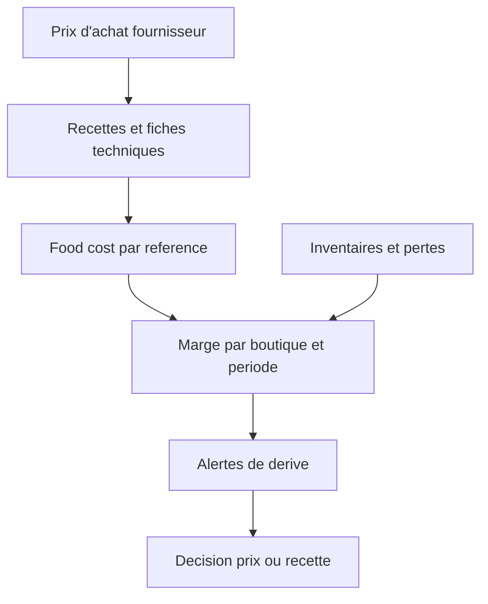

---

## Facturation

`facturation` · famille **Pilotage** · ordre 13 · 5 fonctions

**Leviers** — O Overhead · E Expérience

**Public visé** — Franchisés, assistantes de gestion, comptables

**Accroche** (85 car.) — Des factures propres, simples à émettre pour l'équipe, simples à lire pour le client.

**Résumé** (257 car.)

La facturation du réseau, pensée pour ceux qui l'utilisent : l'équipe émet une facture juste en quelques gestes, le client B2B reçoit un document lisible, et la comptabilité exporte sans retraitement. Avoirs, corrections et relances suivent le même dossier.

**Phrase d'onboarding** — Se branche sur ce qui vend déjà : webshop, caisse, B2B. Première semaine, vous posez les modèles du réseau et l'export du comptable — ensuite les factures partent du bon montant, du premier coup.

### Ce que ce module fait disparaître

- **Le même montant se ressaisit trois fois** — La vente, la facture et l'écriture comptable vivent dans trois outils. Chaque ressaisie est une erreur possible.
- **La facture est illisible** — Un document généré pour le comptable, pas pour le client : le service facturé se devine, et le téléphone sonne.
- **L'avoir se perd** — Une correction faite dans un coin sans lien avec la facture d'origine : au rapprochement, plus personne ne sait pourquoi.

### Ce qu'il apporte

- **Émise depuis la vente** — Webshop, caisse et commandes B2B deviennent des factures sans ressaisie.
- **Lisible par le client** — Modèles du réseau, libellés clairs, TVA par ligne : le document s'explique tout seul.
- **L'avoir reste rattaché** — Corrections et avoirs suivent la facture d'origine, avec leur motif.
- **L'export part sans retraitement** — Le comptable reçoit son format ; personne ne repasse derrière.

### Le menu, entrée par entrée (5)

| Entrée | Leviers | À quoi elle sert | Le gain |
| --- | --- | --- | --- |
| **Émission et modèles** `emission` | O | Les factures partent des ventes réelles, sur les modèles du réseau : mentions, numérotation et TVA justes par construction. | Émettre une facture ne demande aucune connaissance comptable. |
| **Comptes clients B2B** `clients` | R | Sociétés, services et adresses de facturation tenus au même endroit que les commandes, avec le numéro de TVA vérifié. | La facture part au bon service du premier coup. |
| **Avoirs et corrections** `avoirs` | O | Toute correction reste rattachée à la facture d'origine, avec son motif et son auteur. | Le rapprochement se fait sans archéologie. |
| **Relances à échéance** `relances` | O | Les factures échues se relancent selon l'échéancier du réseau, avec l'historique dans le dossier client. | L'encours client baisse sans y passer ses soirées. |
| **Exports comptables** `export` | O | L'export part dans le format du cabinet — journal, pièces et TVA — sans retraitement manuel. | Le comptable cesse de retaper le mois. |

### Ce qu'il échange avec les autres modules

- reçoit de **webshop** : les commandes en ligne facturables
- reçoit de **pos** : les tickets et clôtures de caisse
- envoie vers **console-franchise** : l'état des paiements clients

### Description longue

La facturation d'un point de vente se joue entre trois personnes qui ne se parlent pas : l'équipe qui vend, le client qui attend sa facture, et le comptable qui retraite. Chacun a son outil, et le même montant se ressaisit trois fois.

Le module prend les ventes là où elles naissent — webshop, caisse, commandes B2B — et en fait des factures propres : modèles du réseau, mentions justes, TVA par ligne. L'équipe émet en quelques gestes, sans connaître la comptabilité. Les avoirs et corrections restent rattachés à la facture d'origine, les relances suivent l'échéance, et l'export part vers le comptable dans son format, sans retraitement.

### Schéma

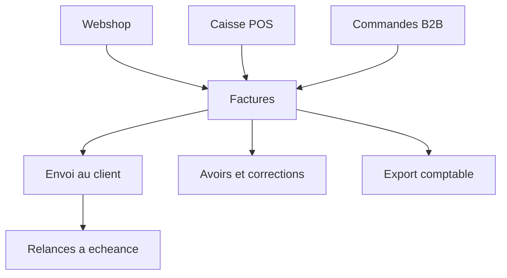

---

## Volumes — ce qu'une mise en page doit encaisser

| Élément | Étendue |
| --- | --- |
| Modules | 13 |
| Familles | Vente, Pilotage, Approvisionnement, Terrain, Développement |
| Fonctions par module | 5 à 22 |
| Leviers par module | 2 à 6 |
| Liens par module | 1 à 4 |
| Problèmes par module | 3 à 4 |
| Bénéfices par module | 4 à 5 |
| Accroche (caractères) | 60 à 94 |
| Résumé (caractères) | 232 à 320 |
| Description (caractères) | 617 à 1834 |
| Nom de fonction (caractères) | 9 à 33 |
| Description de fonction (caractères) | 65 à 220 |

Le cas de test d'une maquette : **Recrutement de franchisés** et ses 22 entrées de menu, à côté de **Facturation** qui en a 5. Les deux dans la même mise en page.
